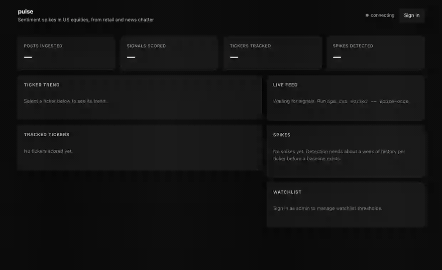
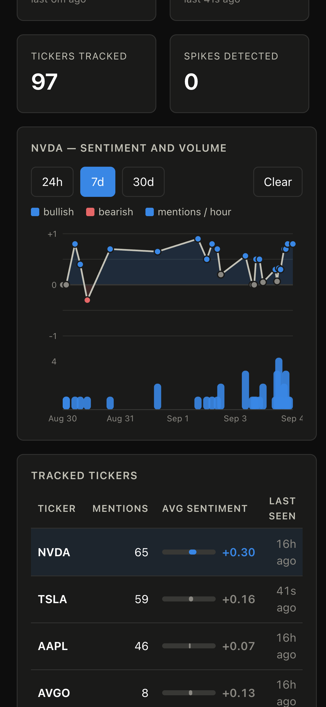

# pulse

r/wallstreetbets mentions NVDA constantly. That is the background hum, not news.
The thing worth knowing is when a ticker nobody discussed yesterday shows up
forty times in an hour — and whether the mood around it just turned. Sentiment
tools mostly cannot tell those apart, because they threshold on how positive a
post reads rather than on how unusual it is for *that ticker*. pulse keeps a
rolling baseline for every symbol it has seen and flags departures from that
symbol's own normal, gating on volume before it trusts a mood swing: a sentiment
reading built from two mentions is noise, and a surge with flat sentiment is
usually just a press release. It does that at a **0.05–0.20% false-positive
rate**, and answers "is there even a ticker here" with a regex and the SEC's
symbol list before spending a single token — which is why **45% of ingested
posts never reach the model at all**.

**[▶ Try it live](https://pulse-b8zd.onrender.com)** ·
demo login `demo@pulse.local` / `demo-read-only`

  
  
  
  
  
  
  
  
  

Every symbol carries a 24-hour sparkline, so eight mentions spread over a
day reads differently from eight in one hour. Opening NVDA draws seven days of
sentiment above mention volume on <strong>stacked axes, never a dual axis</strong>;
hovering reads off a single hour. Then a real scoring run — the signal count and
the feed at the end are model output landing over the live connection, not a
mock.

> The demo runs on free tiers and sleeps after fifteen minutes idle, so the first
> load may spend up to a minute waking the service. A sleeping service also
> ingests nothing, which is why the repo ships a keepalive workflow.

## Stack

**Backend:** TypeScript, Node 24, Express 5, PostgreSQL 17, Gemini Flash Lite, Twilio
**Frontend:** TypeScript, React 19, Vite, hand-rolled SVG charts, hash routing, Server-Sent Events

## Features

- **Spikes measured against each ticker's own history**, not a global threshold —
  a small-cap going from two mentions an hour to forty registers, while NVDA's
  constant chatter does not.
- **Volume and sentiment are separate z-scores**, and only a surge that *also*
  moves the mood earns an alert. A volume spike with flat sentiment is usually a
  scheduled news cycle, and alerting on those is how a channel gets muted.
- **The model never searches for tickers.** A regex plus the SEC's listed-symbol
  list proposes candidates, so nearly half of all posts resolve for free and the
  model only judges context and mood.
- **Hard validation on model output** — every numeric bound re-checked locally,
  invented tickers dropped, and the returned post ids required to match the ones
  sent, so a batched response can never attach one post's sentiment to another.
- **A dashboard you can actually use** — sortable and filterable ticker tables
  with per-symbol sparklines, a detail view per ticker, and a spikes log, all
  linkable by URL.
- **Live updates without a refresh**, over SSE with a cursor-based polling
  fallback for hosts that buffer streamed responses.
- **Per-ticker trend view** with sentiment and mention volume on separate
  stacked axes — never a dual-axis chart, and sentiment fixed to the full
  −1..+1 range so a trivial wobble cannot be rescaled into a crisis.
- **One post can produce several signals.** A story about Fannie Mae approving
  VantageScore scored **TRU −0.40**, **EFX −0.40** and **FICO −0.90** — the last
  being the company actually losing its monopoly.
- **SMS alerts** on watchlisted tickers, behind four independent spend brakes: a
  watchlist opt-in, a kind filter, a per-ticker cooldown, and a rolling daily
  budget.
- **Public by default, read-only demo account, admin for anything that spends** —
  with a test that proves no anonymous route can reach a paid provider.
- **Runs at $0.** Public RSS in, a free-tier model quota, free-tier hosting.

## Docs

[Architecture](docs/architecture.md) · [Measurements](docs/measurements.md) ·
[HTTP API](docs/api.md) · [Running it locally](docs/development.md) ·
[Deployment](docs/deployment.md)

## Status

Built across nine milestones. Two things are deliberately unfinished, and saying
so is cheaper than implying otherwise:

**SMS alerting is verified to the provider boundary, not through it.** A Twilio
number is a recurring cost and this project otherwise runs at $0. Message
composition, the retry policy, masked storage, the duplicate-send constraint and
all four spend brakes are tested against a fake notifier; what is unexercised is
one authenticated form POST. Enabling it is a `.env` change.

**The scoring eval awaits hand labels.** `eval/labels.jsonl` holds 25 stratified
posts and 48 ticker judgements. The model's own predictions are excluded from
that file on purpose — labels anchored on them would mostly measure the model
agreeing with itself.

[Measurements](docs/measurements.md) also records two measurements that turned
out to be **wrong**, and how they were caught, because an audit trail containing
only successes is not an audit trail.

## Licence and data

The code is MIT — see [LICENSE](LICENSE).

Ingested content is not redistributed. pulse stores post titles, short excerpts
and links back to the source; no feed data ships in this repository. Sources are
Reddit's public `.rss` endpoints, [hnrss.org](https://hnrss.org) and Google News
RSS, each polled well inside its limits and identified by a `USER_AGENT`
carrying a real contact address.

The ticker allowlist in `config/tickers.json` derives from the SEC's public
[`company_tickers.json`](https://www.sec.gov/files/company_tickers.json), a US
government work not subject to copyright.

Sentiment scores are produced by a language model and are wrong sometimes. This
is a portfolio project, not investment advice.
